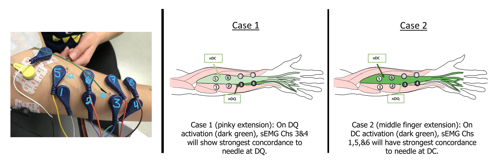

# Forearm_BioSPPy_Pulse_Analysis
Used the Pythion BioSPPy processing library to filter forearm EMG data and compare the onset counts between surface and needle electrodes. 

This experiment was performed and analyzed in 2020 on myself with help from my research assistants Xiaoyi Ma and Ruby Rios Ramirez. The objective of this experiment was to see if concurrent recording of invasive EMG (nEMG) and non-invasive EMG (sEMG) could support our hypothesis: surface electrodes closest to a needle electrode will record high activity only during the activation of the target muscle (where the needle is inserted). This is further explained in the image below with the two cases and in the jupyter notebook. 

This experiment was meant to be a precursor to the invasive throat project in which we'd be inserting hookwire electrodes into the subject’s throat and place a multi-electrode array over the surface area of the neck. Due to the sensitivity of this experiment, my professors wanted a proof-of-concept before committing to inserting needles into people’s neck. Additionally, due to COVID, I was limited in the available technology and therefore had to use two separate instruments to record EMG-- not an ideal scenario but we did what we could as a lab.

